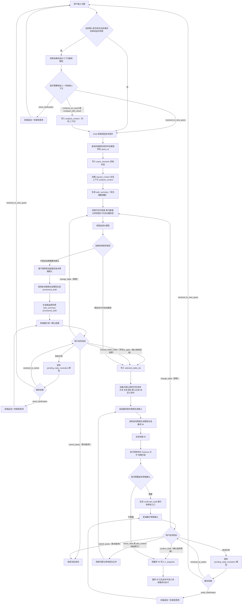
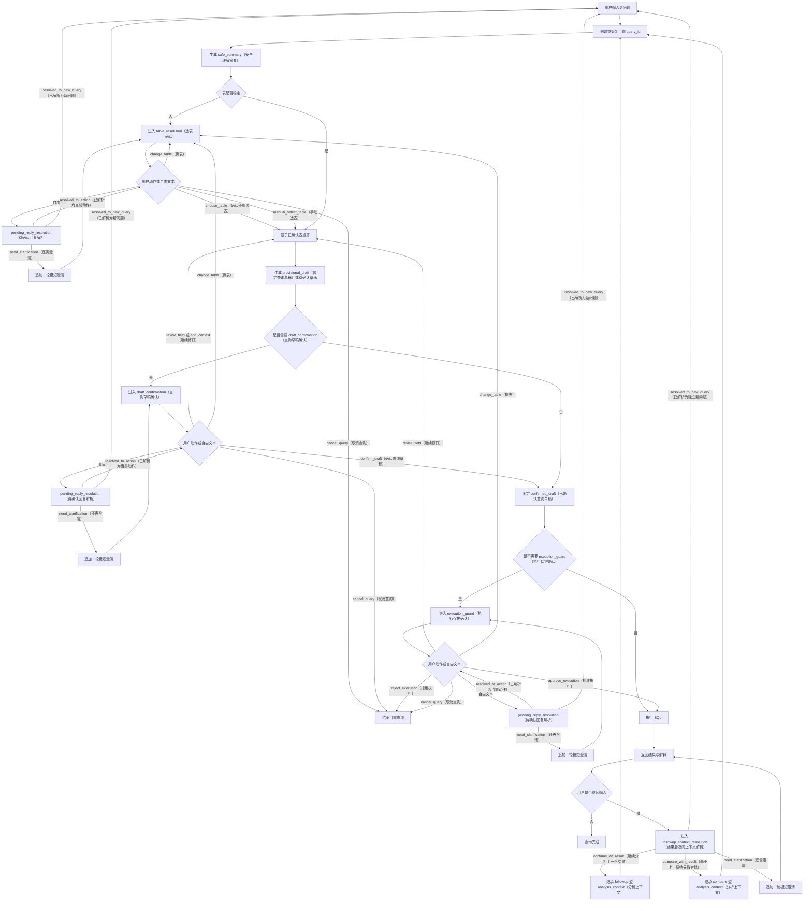
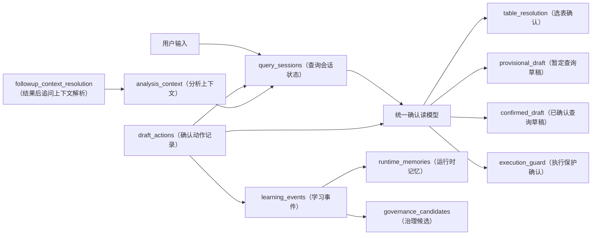

# 统一确认现状与目标态落地路线图

## 1. 文档信息

- 状态：收敛稿
- 类型：现状判断与落地路线文档
- 最后更新时间：2026-04-20

## 2. 文档目标

本文档只回答四个问题：

- 当前系统到底走到了哪一阶段
- 为什么说当前系统还不是目标态
- 从当前系统走到目标态，还需要补哪几步
- 目标态完整流程应长成什么样

## 3. 当前总判断

当前系统已经不是早期那种“只有表选择确认和高成本确认”的状态。

截至当前代码，统一确认相关能力已经完成了第一阶段收敛：

- `query_sessions`（查询会话状态）已经成为查询产品状态主线
- `draft_actions`（确认动作记录）已经成为确认动作主线
- `Chat.vue` 已经以统一确认容器作为主路径
- `table_resolution`（选表确认）
- `draft_confirmation`（查询草稿确认）
- `execution_guard`（执行保护确认）
- 三个确认节点都已接通按钮动作
- 待确认阶段自由文本已经可以作用于当前 `query_id`
- 高置信度自动选表后的纠错入口已经存在

因此，当前系统更准确的定位不是“还没做统一确认”，而是：

- 已完成统一确认第一阶段
- 还没有达到统一确认目标态

## 4. 为什么当前还不是目标态

当前系统离目标态，主要还差以下几层：

### 4.1 还没有真正的统一确认读模型

当前前端虽然已经有统一确认容器，但后端输出仍然主要是：

- `candidate_snapshot`（候选表快照）
- `draft_confirmation_card`（查询草稿确认卡）
- `execution_guard`（执行保护确认卡）

它们本质上还是按节点分别写入 `query_sessions.state_json`，还没有收敛成目标态里的统一读模型：

- `safe_summary`（安全理解摘要）
- `table_resolution`（选表确认）
- `provisional_draft`（暂定查询草稿）
- `confirmed_draft`（已确认查询草稿）
- `execution_guard`（执行保护确认）
- `pending_actions`（待处理动作）

### 4.2 表未确认时还不能展示真正的暂定草稿

当前默认链路里，只要表选择需要确认，就会提前停在 `table_resolution`（选表确认）。

这意味着当前系统还做不到目标态要求的：

- 表未确认时先展示安全理解摘要
- 同时展示基于推荐表生成的 `provisional_draft`（暂定查询草稿）
- 在同一个确认容器里连续承接后续 `draft_confirmation`（查询草稿确认）

### 4.3 待确认阶段的自由文本还不是目标态解析方式

当前待确认阶段的自然语言回复已经可用，但它主要还是规则型解析，核心目标是把文本尽快映射成当前节点下的有限动作。

目标态要求的并不是简单关键词匹配，而是显式增加：

- `pending_reply_resolution`（待确认回复解析）

并且只允许返回：

- `resolved_to_action`
- `resolved_to_new_query`
- `need_clarification`

当前系统还没有这一层显式解析阶段。

### 4.4 结果后的继续追问还没有目标态上下文路由

当前结果完成后，用户继续输入时，还没有单独的结果上下文解析阶段。

目标态要求补上：

- `followup_context_resolution`（结果后追问上下文解析）
- `analysis_context`（分析上下文）

并让系统先判断这句输入是：

- 围绕上一份结果继续分析
- 基于上一份结果做对比型追问
- 独立新问题
- 还是需要再补一句极短澄清

这一层当前还没有落地。

### 4.5 当前动作协议仍偏过渡态

当前动作协议已经比老链路统一很多，但动作名仍偏工程兼容写法，例如：

- `confirm`
- `revise`
- `change_table`
- `execution_decision`
- `exit_current`

目标态希望进一步收敛成更明确的产品动作语义，例如：

- `choose_table`（确认使用该表）
- `manual_select_table`（手动选表）
- `confirm_draft`（确认查询草稿）
- `approve_execution`（批准执行）
- `cancel_query`（取消查询）

也就是说，当前已经有动作协议，但还没有完全长成目标态动作协议。

### 4.6 学习闭环和治理闭环还没接上

目标态里，用户确认、换表、修订、追问不只是一次性交互，还要继续派生：

- `learning_events`（学习事件）
- `runtime_memories`（运行时记忆）
- `governance_candidates`（治理候选）

当前统一确认主链路已经有状态和动作，但还没有完整接到后面的学习与治理闭环。

## 5. 当前所处阶段

可以把统一确认这条线分成五个阶段来理解。

| 阶段 | 阶段定义 | 当前状态 |
| --- | --- | --- |
| 阶段零 | 老链路，确认状态分散在表选择字段、`force_execute`、旧确认卡里 | 已经过去 |
| 阶段一 | `query_sessions（查询会话状态） + draft_actions（确认动作记录） + 统一确认容器` 落地，三段确认可跑通 | 已完成 |
| 阶段二 | 统一确认读模型落地，明确 `safe_summary（安全理解摘要） / provisional_draft（暂定查询草稿） / confirmed_draft（已确认查询草稿）` 分层 | 未完成 |
| 阶段三 | `pending_reply_resolution`（待确认回复解析）落地，待确认自由文本可显式区分回复当前还是开启新问题 | 未完成 |
| 阶段四 | `followup_context_resolution（结果后追问上下文解析） + analysis_context（分析上下文）` 落地，结果后追问和对比型追问走统一路由 | 未完成 |
| 阶段五 | 学习事件、运行时记忆、治理候选接通，统一确认进入闭环产品阶段 | 未完成 |

因此当前最准确的判断是：

- 当前在阶段一
- 距离目标态至少还差阶段二到阶段四
- 阶段五属于闭环增强，不是目标态确认主流程的第一落点，但最终必须接上

## 6. 从当前到目标态的落地路线

### 6.1 第一段：先补统一确认读模型

这一段是最优先的，因为它决定前后端是否真的在说同一套确认语言。

这一段建议完成以下事项：

- 固定统一确认读模型结构
- 让 `query_sessions.state_json` 可以稳定派生统一确认读模型
- 把当前分散的 `candidate_snapshot`（候选表快照）、`draft_confirmation_card`（查询草稿确认卡）、`execution_guard`（执行保护确认卡）收敛到同一输出结构
- 明确区分：
  - `safe_summary`（安全理解摘要）
  - `provisional_draft`（暂定查询草稿）
  - `confirmed_draft`（已确认查询草稿）
- 明确表未确认时哪些内容只能算暂定理解，不能算最终理解

这一段完成后，前端统一确认容器虽然仍可复用，但它读到的就不再是三块分散状态，而是一份统一读模型。

### 6.2 第二段：补 `pending_reply_resolution`（待确认回复解析）

这一段解决的是“确认中继续输入一句话，到底是在继续刚才这条查询，还是已经开始新问题”。

这一段建议完成以下事项：

- 增加待确认自由文本解析阶段
- 让自由文本不再直接进入简单规则映射
- 固定三类解析结果：
  - `resolved_to_action`（已解析为当前查询动作）
  - `resolved_to_new_query`（已解析为新问题）
  - `need_clarification`（还需要补一句澄清）
- 只有 `resolved_to_action` 时，才继续落当前 `query_id` 的 `draft_actions`（确认动作记录）
- 只有 `resolved_to_new_query` 时，才允许新建 `query_id`

这一段完成后，当前“确认中输入一句新问题，系统却当成修订意见”的风险会明显下降。

### 6.3 第三段：补 `followup_context_resolution`（结果后追问上下文解析）

这一段解决的是“结果完成后继续追问”的产品语义。

这一段建议完成以下事项：

- 增加结果后输入解析阶段
- 固定四类解析结果：
  - `continue_on_result`（基于上一份结果继续分析）
  - `compare_with_result`（基于上一份结果发起对比）
  - `resolved_to_new_query`（已解析为独立新问题）
  - `need_clarification`（还需要补一句澄清）
- 给新查询补最小 `analysis_context`（分析上下文）
- 让追问和对比型追问在进入 `table_resolution`（选表确认）前先完成结果上下文路由

这一段完成后，系统才算真正具备目标态要求的“结果后继续分析”和“基于上一份结果做对比”的能力。

### 6.4 第四段：按需显式化 `query_drafts`（查询草稿对象）

当前第一阶段是把草稿读模型先压在 `query_sessions.state_json` 里。

这条路在第一阶段是合理的，但当以下信号出现时，就应考虑把 `query_drafts` 显式化：

- `state_json` 里草稿相关字段越来越多
- 一个查询需要清晰保留多个版本
- 前端需要回看历史草稿版本
- 追踪修订链和确认链开始变得困难

因此，`query_drafts`（查询草稿对象）更适合作为统一确认第二波结构增强，而不是第一阶段前置条件。

### 6.5 第五段：接上学习与治理闭环

这一段不是为了让确认流程“能跑通”，而是为了让确认流程“能持续变聪明”。

这一段建议完成以下事项：

- 用户换表、修订、确认时派生 `learning_events`（学习事件）
- 聚合稳定模式后再形成 `runtime_memories`（运行时记忆）
- 再把高收益问题推进到 `governance_candidates`（治理候选）
- 明确一次交互事实和长期治理规则之间的边界

这一段完成后，统一确认才从“交互机制”升级为“产品闭环”。

## 7. 到目标态的最小实施顺序

如果只关心最小可落地顺序，建议固定为：

1. 先补统一确认读模型
2. 再补 `pending_reply_resolution`（待确认回复解析）
3. 再补 `followup_context_resolution`（结果后追问上下文解析）
4. 再视复杂度决定是否显式建 `query_drafts`（查询草稿对象）
5. 最后接入学习闭环和治理闭环

不建议反过来做：

- 先做学习闭环，再回头补确认读模型
- 先做 `analysis_context`（分析上下文），但前面的确认语义仍然不稳定
- 先把前端组件继续堆复杂，而后端读模型仍未统一

## 8. 目标态流程说明

目标态中，一条完整查询不再只是“选表确认 -> 执行确认”。

目标态应统一为下面这条主线：

1. 用户输入新问题
2. 系统创建或恢复当前 `query_id`
3. 系统先形成 `safe_summary`（安全理解摘要）
4. 如表不稳定，进入 `table_resolution`（选表确认）
5. 表确认后生成 `provisional_draft`（暂定查询草稿）或直接生成待确认草稿
6. 如草稿仍需确认，进入 `draft_confirmation`（查询草稿确认）
7. 如执行风险超限，进入 `execution_guard`（执行保护确认）
8. 查询执行并返回结果
9. 结果后继续输入时，先进入 `followup_context_resolution`（结果后追问上下文解析）
10. 只有明确为独立新问题时，才彻底脱离上一份结果上下文

同时，目标态还必须满足两个产品原则：

- 所有继续执行动作都复用当前产品级 `query_id`
- 同一个输入框既服务新问题，也服务确认回复和结果后追问，但内部必须先做语义路由

## 9. 目标态从用户输入到最终 IR 生成的详细流程图

下面这张图只聚焦一件事：

- 一条查询从用户输入开始
- 如何经过前端、后端、状态写入、用户交互和大模型调用
- 最终把可执行前的最终 IR 固化出来

这张图故意把“大模型调用点”和“用户交互点”单独展开，因为它们正是统一确认目标态里最容易混淆的部分。

## 10. 目标态主流程图

下面这张图描述的是目标态下，从新问题进入，到确认、执行、结果和继续追问的完整主流程。

说明：

- Mermaid 图里左侧的标识只是节点引用名，不是业务名词
- 我已把原来的英文或短编号节点引用名改成中文引用名
- 真正给人看的内容是方括号或大括号里的中文标签

## 11. 目标态对象关系图

下面这张图描述的是目标态下，各个关键对象在主流程中的关系。

## 12. 目标态验收标准

如果后续要判断“是否真的达到目标态”，建议至少满足以下标准：

- 前端确认区只依赖统一确认读模型，不再依赖多套 fallback 状态
- 表未确认时，能稳定展示 `safe_summary`（安全理解摘要）和 `provisional_draft`（暂定查询草稿）
- 待确认阶段自由文本已走 `pending_reply_resolution`（待确认回复解析）
- 结果后的继续追问已走 `followup_context_resolution`（结果后追问上下文解析）
- `analysis_context`（分析上下文）已能支撑结果后继续分析和对比型追问
- 动作协议已明确映射到产品语义动作
- `change_table` 会稳定触发草稿、IR、SQL、结果失效与重算

## 13. 改造期是否需要现在确定最终架构

需要。

但这里说的“现在确定”，不是把所有实现细节一次性定死，而是现在就把目标态架构的骨架、边界和不可回退约束定下来。

如果当前阶段不尽快完成这一步，后续最容易出现四类问题：

- 前后端职责继续漂移，动作提交后到底由谁续跑会反复变化
- `query_sessions.state_json`（查询会话状态 JSON）持续吸收临时字段，越来越像过渡态大杂烩
- 过渡期协议被误当长期契约，后面更难收敛统一确认读模型
- 每做完一轮交互改造，就要再返工一次状态机和回退逻辑

因此，从专业架构视角看，当前最合理的做法是：

- 现在冻结目标态逻辑架构
- 现在冻结统一确认主流程和关键对象边界
- 暂不冻结所有物理实现细节
- 允许分阶段渐进落地

### 13.1 现在必须拍板的内容

下面这些内容如果现在不定，后续几乎一定返工。

- 前后端职责边界
  - 前端只负责展示统一确认视图、提交动作、订阅状态结果
  - 后端负责状态推进、语义路由、重算、续跑和回退
- 主状态机
  - 从用户输入、选表确认、查询草稿确认、执行保护确认、结果返回到结果后追问的主链路必须固定
- `query_id`
  - 一条查询在确认、修订、执行和追问过程中必须围绕同一个产品级 `query_id` 演进
- 统一确认读模型
  - 目标态必须明确以统一确认读模型作为前端主协议，而不是长期保留多套 fallback 状态并行
- 两类语义路由节点
  - `pending_reply_resolution`（待确认回复解析）必须存在
  - `followup_context_resolution`（结果后追问上下文解析）必须存在
- 回退和失效规则
  - `change_table`（换表）触发后，草稿、IR、SQL、结果失效与重算规则必须固定
- IR 的产品地位
  - IR 必须继续作为中间标准产物，前端确认交互不能绕过 IR 直接绑定 SQL

### 13.2 现在不必定死的内容

下面这些内容需要方向，但不适合在当前阶段过早冻结。

- 是否立刻把 `query_drafts`（查询草稿对象）独立成正式表
- `query_sessions.state_json`（查询会话状态 JSON）最终会拆成几张表
- LangGraph 内部节点的最终拆分颗粒度
- Prompt 细节编排和模型调用微流程
- 学习闭环、治理闭环的完整物化方式
- 日志字段、事件字段、内部枚举名的最终细节

也就是说，现在应冻结的是逻辑结构和公共契约，而不是所有底层实现形态。

### 13.3 当前不能继续摇摆的边界

下面这些边界如果继续摇摆，系统会长期停留在过渡态。

- 动作提交后由谁负责继续跑
  - 目标态必须由后端负责，不能长期依赖前端重新拉起查询
- 用户自由文本是否先做语义路由
  - 目标态必须先判断“回复当前确认”“结果后追问”“独立新问题”
- 结果后追问是否属于正式主流程
  - 目标态必须把它纳入主状态机，而不是当附加能力处理
- 统一确认是否长期允许多协议并存
  - 目标态不应长期维持选表确认卡、草稿确认卡、执行保护卡各自独立协议
- `analysis_context`（分析上下文）与长期记忆是否混层
  - 目标态必须把短期分析上下文和长期学习记忆分开

### 13.4 推荐的冻结方式

建议把“最终架构确定”拆成三层，而不是一次性全冻结。

第一层，现在冻结：

- 产品主流程
- 状态机
- 核心对象
- 动作协议语义
- 前后端职责边界

第二层，分阶段收敛：

- 统一确认读模型的具体字段
- `query_drafts`（查询草稿对象）是否显式化
- 学习事件与治理候选的接入路径

第三层，后续按实现再优化：

- 内部表结构
- 节点颗粒度
- Prompt 细节
- 运行时优化和治理策略

因此，“现在确定最终架构”最准确的理解应是：

- 现在确定目标态骨架
- 现在确定不可回退边界
- 不要现在把所有实现细节全部定死

## 14. 一句话结论

当前系统已经走到统一确认第一阶段，但还没有长成目标态。

从当前到目标态，最关键的不是继续堆按钮，而是继续完成三件事：

- 把统一确认读模型做完整
- 把待确认文本解析做成显式路由
- 把结果后追问上下文做成显式路由
